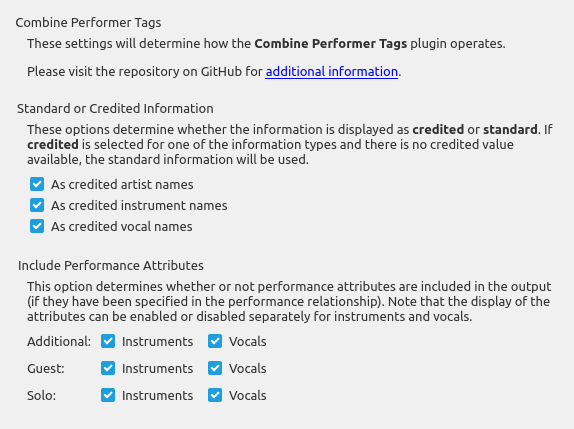

# Combine Performer Tags \[[Download](https://github.com/rdswift/picard-plugins/raw/2.0_RDS_Plugins/plugins/combine_performer_tags/combine_performer_tags.zip)\]

## Overview

This plugin combines all instrument and vocal performer tags into a new multi-value variable `%_performers%` for each track. It requires that the "***Use track relationships***" setting is enabled in **Options** -> **Metadata**. Each item in the variable is the performer's name followed by the instruments and vocals they performed, for example "*Jackson Browne (acoustic guitar, piano, lead vocals)*".

The plugin makes no additional calls to the MusicBrainz database, and it does not remove any of the `%performer:*%` tags.

---

## Option Settings

The plugin adds a settings page under the "Plugins" section under "Options..." from Picard's main menu.  This allows you to control how the plugin operates with respect to processing track performance artists and the attribute details included in `%_performers%` variable.



---

## What it Does

This plugin reads the track metadata provided to Picard, extracts the list of associated instrument and vocal performers, and combines the information in a multi-value variable for use in Picard scripts.

---

## Example Usage

You can use the following tagger script to include this in the tags written to the files:

```taggerscript
$noop( Set as a multi-value tag. )
$setmulti(Performers,%_performers%)
```

or:

```taggerscript
$noop( Set as a regular text tag. )
$set(Performers,%_performers%)
```

If you have included this as a combined tag, you might also want to remove the individual `%performer:*%` tags, which can be accomplished by the tagger script:

```taggerscript
$unset(performer:*)
```

---
